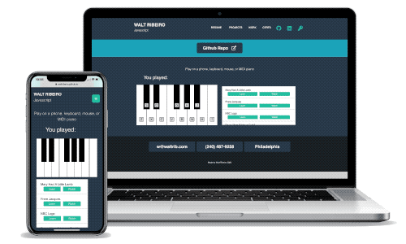

# React Portfolio

## [Description](#description) &nbsp;&bull;&nbsp; [License](#License) &nbsp;&bull;&nbsp; [Images](#images")
  
## Description

This is my React Portfolio. It was built using React.js and React Router. I showcase 6 apps, have a contact form, and an about page.

## License
  This project is licensed under the <a href="https://opensource.org/licenses/MIT">MIT license</a>
 
    
 

## Images
  
  
   
  
  
 

